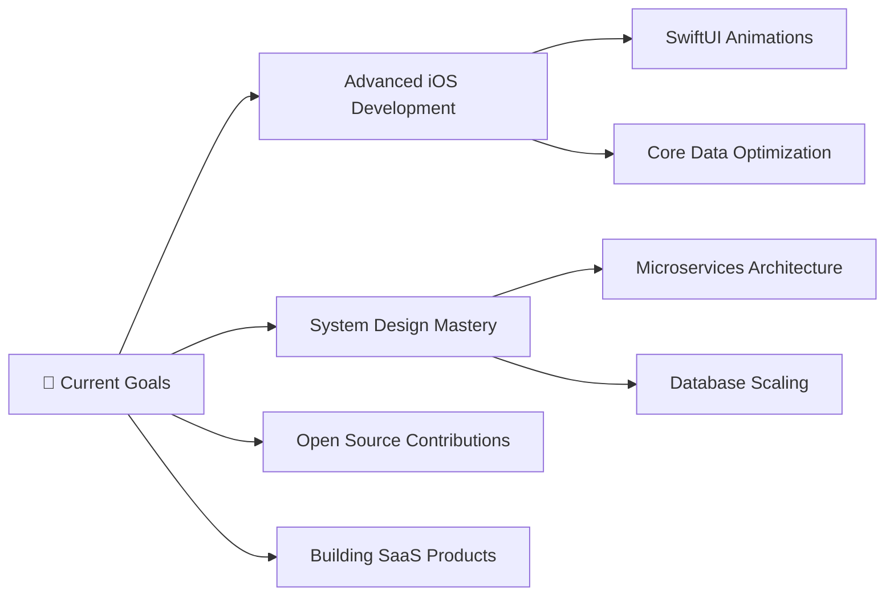

<div align="center">

# 👋 Hello, I'm Deepak Prajapati

### 🚀 Full Stack Developer | 📱 iOS App Developer | 🏏 Cricketer turned Coder

[](https://my-portfolio-man.vercel.app/)
[](https://linkedin.com/in/deepak-prajapati123)
[](https://github.com/deepakstwt)
[](mailto:deepakprajapatiproplus@gmail.com)


</div>

## 🎯 About Me

```typescript
const deepak = {
    title: "Full Stack & iOS Developer",
    location: "Greater Noida, India",
    education: "B.Tech CSE @ Galgotias University (CGPA: 8.57/10)",
    currentFocus: "Building scalable mobile and web applications",
    experience: ["iOS Development @ Infosys", "Frontend Development @ Motion Cut"],
    
    quickFacts: {
        💼: "iOS Developer Intern at Infosys Campus, Mysore",
        🎓: "Computer Science Engineering Student",
        🏏: "Former District Cricket Captain",
        🌱: "Currently learning Advanced iOS Development & System Design",
        ⚡: "Fun fact: Transitioned from cricket field to code editor!"
    }
};
```

## 🛠️ Tech Arsenal

### 💻 Languages & Fundamentals


### 🌐 Frontend Development


### 📱 iOS Development


### ⚙️ Backend Development


### 🗄️ Databases & Backend Services


### 🛠️ Tools & Technologies


## 🚀 Featured Projects

<div align="center">

### 🏘️ [NeighborFit](https://github.com/deepakstwt/NeighborFit)
**Full-Stack Neighborhood Discovery Platform** `React.js` `Node.js` `MongoDB` `OpenAI API`

🎯 **Impact**: 500+ users | 60% engagement increase | 40% faster search times
- Built AI-powered recommendation engine with real-time chatbot
- Implemented secure JWT authentication and user rating system
- Designed responsive UI with real-time notifications

---

### 👶 [Faby](https://github.com/AkshayS734/Faby)
**iOS Toddler Growth Tracking App** `Swift` `SwiftUI` `Firebase` `Supabase`

🎯 **Impact**: 50% improved data consistency | 95% user satisfaction | 30% fewer missed appointments
- Integrated EventKit for vaccination reminders and MapKit for location features
- Real-time data synchronization across devices
- [📱 View Demo](https://drive.google.com/drive/folders/1rPIuF66dQjgbvrY6MzUDEutm2oC1TASt?usp=sharing)

---

### 🚛 [Fleet Management System](https://github.com/Ricky30feb/Fleet-Master)
**Enterprise Fleet Management Solution** `SwiftUI` `Supabase` `MapKit` `Firebase`

🎯 **Impact**: 25% operational efficiency | 40% faster emergency response | 99% security
- Role-based access system with secure authentication
- Live trip tracking with real-time SOS alerts
- Managed using Agile methodologies in Jira
- [📱 View Demo](https://drive.google.com/drive/folders/1uw9GEk39PV2FfTuXtY5vFRhNg-LFimwX?usp=sharing)

</div>

## 💼 Professional Experience

### 🔹 iOS Developer Intern | Infosys Campus, Mysore
`March 2025 – April 2025` • **On-site**
- Developed secure iOS applications using **Swift** and **SwiftUI**
- Integrated **Supabase** authentication reducing login friction by **40%**
- Achieved **99%** application uptime with Firebase monitoring
- **95%** test coverage through comprehensive unit testing

### 🔹 Frontend Developer Intern | Motion Cut Video Studio
`October 2023 – November 2023` • **Hybrid**
- Built responsive applications with **React.js**, **JavaScript**, **HTML5**, **CSS3**
- Optimized performance reducing page load time by **35%**
- Developed reusable UI components increasing team efficiency by **25%**

## 📊 GitHub Analytics

<div align="center">


</div>

## 🎓 Education & Certifications

- 🎓 **B.Tech Computer Science Engineering** | Galgotias University (2022-2026) | **CGPA: 8.57/10**
- 📜 **Compiler Design Certificate** | [NPTEL, IIT Kharagpur](https://drive.google.com/drive/folders/1F5XH4AHXKgnTCndz12AZ-A6aGpz8XIYL?usp=sharing)
- 🌐 **Full Stack Web Development** | [Udemy (Angela Yu)](https://drive.google.com/drive/folders/1F5eDvCmpr4fn_vLn7yoFVPyiiyt8mU_A?usp=sharing)

## 🌟 Leadership & Volunteering

- 🏏 **Cricket Captain** - District Team (Leadership & Team Management)
- 🤝 **Volunteer** - Strayniya NGO, Delhi (Community Service)
- 📚 **Mentor** - Peer coding sessions and project guidance

## 📈 Current Focus



## 📞 Let's Connect!

<div align="center">

[](https://my-portfolio-man.vercel.app/)
[](https://linkedin.com/in/deepak-prajapati123)
[](mailto:deepakprajapatiproplus@gmail.com)

### 💬 Always open to discussing:
**Mobile App Development** • **Full Stack Projects** • **System Design** • **Career Opportunities** • **Cricket** 🏏

---


<details>
<summary>🐍 Contribution Snake</summary>
<br>

<picture>
  <source media="(prefers-color-scheme: dark)" srcset="https://raw.githubusercontent.com/tobiasmeyhoefer/tobiasmeyhoefer/output/github-snake-dark.svg" />
  <source media="(prefers-color-scheme: light)" srcset="https://raw.githubusercontent.com/tobiasmeyhoefer/tobiasmeyhoefer/output/github-snake.svg" />
  
</picture>

</details>

<sub>⭐ **Star this repo if you find it interesting!** ⭐</sub>

[](https://visitcount.itsvg.in)

*"From cricket fields to code commits - building the future one line at a time!"* 🚀

</div>
