<div align="center">


<br>

## 👋 Hello, I'm **Deepak Prajapati**

### 💻 Full Stack Developer | 📱 iOS App Developer | 🏏 Cricketer turned Coder

<br>

[](https://my-portfolio-man.vercel.app/)
[](https://linkedin.com/in/deepak-prajapati123)
[](https://github.com/deepakstwt)
[](mailto:deepakprajapatiproplus@gmail.com)


<picture>
  <source media="(prefers-color-scheme: dark)" srcset="https://raw.githubusercontent.com/deepakstwt/deepakstwt/output/github-contribution-grid-snake-dark.svg">
  <source media="(prefers-color-scheme: light)" srcset="https://raw.githubusercontent.com/deepakstwt/deepakstwt/output/github-contribution-grid-snake.svg">
  
</picture>

</div>


 About Me


```typescript
const deepak = {
    title: "Full Stack & iOS Developer",
    location: "Greater Noida, India 🇮🇳",
    education: "B.Tech CSE @ Galgotias University (CGPA: 8.57/10)",
    currentFocus: "Building scalable mobile and web applications",
    experience: ["iOS Development @ Infosys", "Frontend Development @ Motion Cut"],
    
    quickFacts: {
        💼: "iOS Developer Intern at Infosys Campus, Mysore",
        🎓: "Computer Science Engineering Student",
        🏏: "Former District Cricket Captain",
        🌱: "Currently learning Advanced iOS Development & System Design",
        ⚡: "Fun fact: Transitioned from cricket field to code editor!",
        🎯: "Goal: Building next-gen mobile experiences",
        ☕: "Powered by: Coffee + Code + Cricket highlights"
    },
    
    dailyRoutine: () => {
        return "☀️ Wake up → ☕ Coffee → 💻 Code → 🏏 Cricket → 🔄 Repeat";
    }
};
```

<div align="center">
  
</div>

## 🛠️ Tech Arsenal

<div align="center">
  
</div>

### 💻 Languages & Fundamentals


### 🌐 Frontend Development  


### 📱 iOS Development


### ⚙️ Backend Development


### 🗄️ Databases & Backend Services


### 🛠️ Tools & Technologies


##  Featured Projects

<div align="center">
  
</div>

<table>
<tr>
<td width="50%">

###  [NeighborFit](https://github.com/deepakstwt/NeighborFit)
**Full-Stack Neighborhood Discovery Platform**


**🎯 Impact Metrics:**
- 📊 **500+** active users
- 📈 **60%** engagement boost  
- ⚡ **40%** faster searches
- 🤖 **AI-powered** recommendations

✨ **Key Features:**
- Real-time chatbot integration
- JWT secure authentication  
- Dynamic user rating system
- Responsive notification system

</td>
<td width="50%">

###  [Faby](https://github.com/AkshayS734/Faby)
**iOS Toddler Growth Tracking App**


**🎯 Impact Metrics:**
- 📊 **50%** data consistency
- 😊 **95%** user satisfaction
- 💉 **30%** fewer missed appointments
- 📱 **Real-time** sync

✨ **Key Features:**
- EventKit vaccination reminders
- MapKit location services
- Cross-device synchronization
- [📱 **View Demo**](https://drive.google.com/drive/folders/1rPIuF66dQjgbvrY6MzUDEutm2oC1TASt?usp=sharing)

</td>
</tr>
<tr>
<td width="50%">

###  [Fleet Management](https://github.com/Ricky30feb/Fleet-Master)
**Enterprise Fleet Management Solution**


**🎯 Impact Metrics:**
- 📊 **25%** operational efficiency
- 🚨 **40%** faster emergency response
- 🔒 **99%** security compliance
- 🗺️ **Live** trip tracking

✨ **Key Features:**
- Role-based access control
- Real-time SOS emergency alerts
- Agile development with Jira
- [📱 **View Demo**](https://drive.google.com/drive/folders/1uw9GEk39PV2FfTuXtY5vFRhNg-LFimwX?usp=sharing)

</td>
<td width="50%">

###  More Projects Coming Soon...
**Always Building Something New**


**🔮 What's Next:**
- 🤖 **AI/ML** integration projects
- 🌐 **Web3** applications
- 📱 **Advanced iOS** features
- ☁️ **Cloud-native** solutions

✨ **Current Focus:**
- System Design mastery
- Performance optimization
- Open source contributions
- Building scalable solutions

</td>
</tr>
</table>

<div align="center">
  
</div>

## 💼 Professional Experience

### 🔹 iOS Developer Intern | Infosys Campus, Mysore
`March 2025 – April 2025` • **On-site**
- Developed secure iOS applications using **Swift** and **SwiftUI**
- Integrated **Supabase** authentication reducing login friction by **40%**
- Achieved **99%** application uptime with Firebase monitoring
- **95%** test coverage through comprehensive unit testing

### 🔹 Frontend Developer Intern | Motion Cut Video Studio
`October 2023 – November 2023` • **Hybrid**
- Built responsive applications with **React.js**, **JavaScript**, **HTML5**, **CSS3**
- Optimized performance reducing page load time by **35%**
- Developed reusable UI components increasing team efficiency by **25%**

##  GitHub Analytics

<div align="center">
  
</div>

<table>
<tr>
<td width="50%">


</td>
<td width="50%">


</td>
</tr>
<tr>
<td colspan="2">


</td>
</tr>
</table>

<div align="center">
  
</div>

<div align="center">
  
</div>

<div align="center">
  
</div>

<div align="center">
  
</div>

## 🎓 Education & Certifications

- 🎓 **B.Tech Computer Science Engineering** | Galgotias University (2022-2026) | **CGPA: 8.57/10**
- 📜 **Compiler Design Certificate** | [NPTEL, IIT Kharagpur](https://drive.google.com/drive/folders/1F5XH4AHXKgnTCndz12AZ-A6aGpz8XIYL?usp=sharing)
- 🌐 **Full Stack Web Development** | [Udemy (Angela Yu)](https://drive.google.com/drive/folders/1F5eDvCmpr4fn_vLn7yoFVPyiiyt8mU_A?usp=sharing)

## 🌟 Leadership & Volunteering

- 🏏 **Cricket Captain** - District Team (Leadership & Team Management)
- 🤝 **Volunteer** - Strayniya NGO, Delhi (Community Service)
- 📚 **Mentor** - Peer coding sessions and project guidance

##  Current Focus & Learning Journey

<div align="center">
  
</div>

<table>
<tr>
<td width="50%">

###  iOS Development Goals
- **SwiftUI Advanced Animations** 🎨
- **Core Data Optimization** 📊  
- **ARKit Integration** 🥽
- **Performance Profiling** ⚡
- **Apple Watch Apps** ⌚
- **Widget Extensions** 📱

</td>
<td width="50%">

###  System Design Mastery
- **Microservices Architecture** 🏗️
- **Database Scaling** 📈
- **Load Balancing** ⚖️
- **Caching Strategies** 🗄️
- **Message Queues** 📮
- **Distributed Systems** 🌐

</td>
</tr>
<tr>
<td width="50%">

###  AI/ML Integration
- **Machine Learning APIs** 🤖
- **Natural Language Processing** 💬
- **Computer Vision** 👁️
- **Recommendation Systems** 🎯
- **Predictive Analytics** 📊
- **Neural Networks** 🧠

</td>
<td width="50%">

###  Cloud & DevOps
- **Kubernetes** ☸️
- **Docker Containerization** 🐳
- **CI/CD Pipelines** 🔄
- **Infrastructure as Code** 📋
- **Monitoring & Logging** 📊
- **Security Best Practices** 🔒

</td>
</tr>
</table>

<div align="center">

###  2025 Roadmap



</div>

<div align="center">
  
</div>

```mermaid
graph TD
    A[🎯 2025 Goals] --> B[📱 Master iOS Development]
    A --> C[🌐 Full Stack Excellence]
    A --> D[🤖 AI/ML Integration]
    A --> E[☁️ Cloud Architecture]
    
    B --> F[SwiftUI Advanced Animations]
    B --> G[ARKit & VisionOS]
    B --> H[Apple Ecosystem Integration]
    
    C --> I[Next.js 15 Mastery]
    C --> J[Real-time Applications]
    C --> K[Progressive Web Apps]
    
    D --> L[LLM Integration]
    D --> M[Computer Vision Apps]
    D --> N[ML Model Deployment]
    
    E --> O[Kubernetes Orchestration]
    E --> P[Serverless Architecture]
    E --> Q[Multi-cloud Strategies]
    
    style A fill:#ff6b6b,stroke:#333,stroke-width:3px,color:#fff
    style B fill:#4ecdc4,stroke:#333,stroke-width:2px
    style C fill:#45b7d1,stroke:#333,stroke-width:2px
    style D fill:#f9ca24,stroke:#333,stroke-width:2px
    style E fill:#6c5ce7,stroke:#333,stroke-width:2px
```

## 📞 Let's Connect & Build Something Amazing!

<div align="center">
  
</div>

<table align="center">
<tr>
<td align="center" width="200">

<br>
<strong>Portfolio</strong>
<br>
<a href="https://my-portfolio-man.vercel.app/">

</a>
</td>

<td align="center" width="200">

<br>
<strong>LinkedIn</strong>
<br>
<a href="https://linkedin.com/in/deepak-prajapati123">

</a>
</td>

<td align="center" width="200">

<br>
<strong>Email</strong>
<br>
<a href="mailto:deepakprajapatiproplus@gmail.com">

</a>
</td>

<td align="center" width="200">

<br>
<strong>Call/WhatsApp</strong>
<br>
<a href="tel:+919648109457">

</a>
</td>
</tr>
</table>

<div align="center">
  
</div>

### <div align="center"> Always open to discussing:</div>

<div align="center">
  
🔹 **Mobile App Development** • **Full Stack Projects** • **System Design** • **Career Opportunities** • **Cricket** 🏏
  
🔹 **Open Source Contributions** • **Tech Mentorship** • **Startup Ideas** • **Code Reviews** 
  
</div>

<div align="center">
  
</div>

<details align="center">
<summary><b>🐍 Watch my contributions get eaten by a snake 🐍</b></summary>
<br>
<div align="center">
  
</div>
</details>

<div align="center">
  
</div>

<div align="center">
  
###  Show some love by starring repositories you find interesting! 

[](https://visitcount.itsvg.in)
[](https://github.com/deepakstwt)
[](https://github.com/deepakstwt)

### 💭 *"From cricket fields to code commits - building the future one line at a time!"* 🚀

 **Made with love by Deepak Prajapati** 

</div> 
